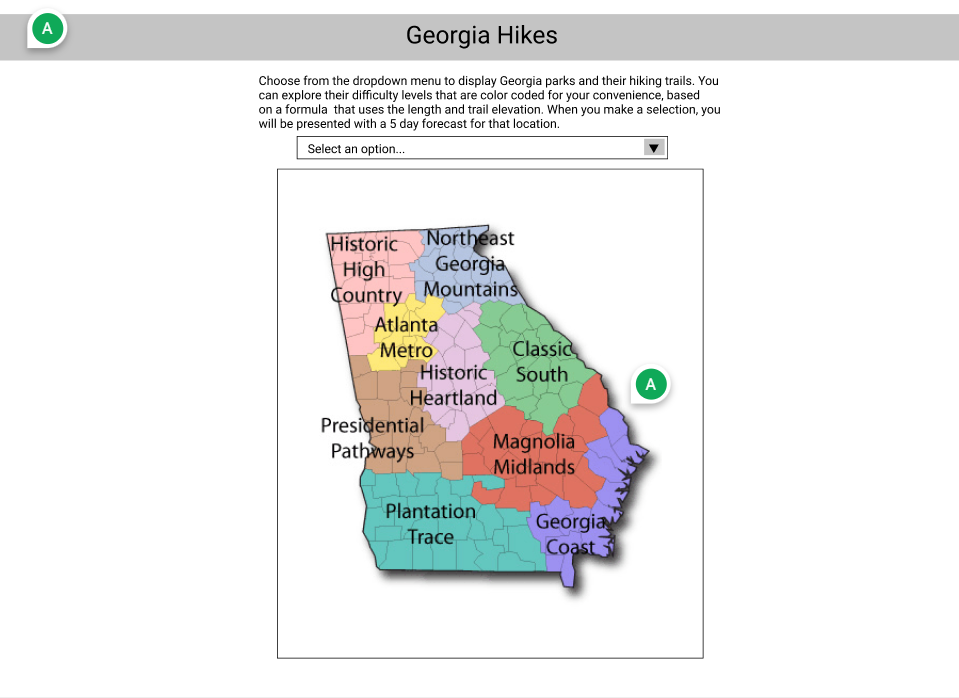
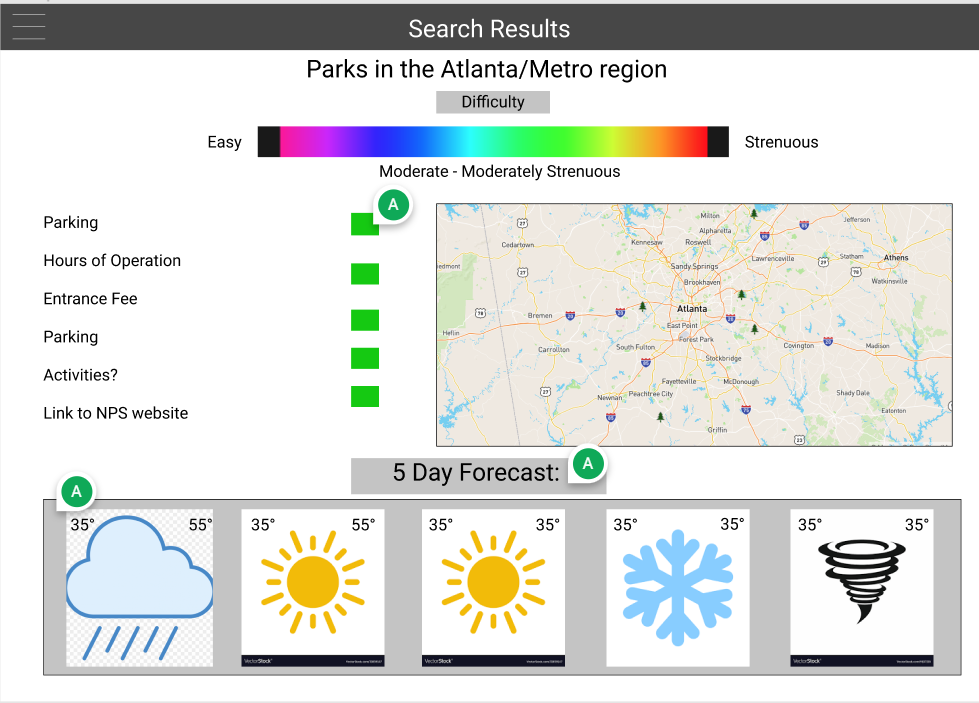

# Georgia Hikes
## Description
Have you ever tried to go hiking in Georgia? Typically you will have a hard time trying to find trails to hike and places to park when you arrive. Our Georgia Hikes app allows users to view our interactive map that shows them where they can hike and the available activities to enjoy at that particular park. This app also allows the user to view the weather for that day they are planning on getting out there!

We developed this app through the most advanced coding bootcamp available on the market at Georgia Tech.
We provide a fast interactive user experience, current and upcoming weather for user hikes, directions, and trail information.

Please visit our app Georgia Hikes if you are interested in hiking Georgia's top rated trails.

## Table of Contents
- [Wireframe](#wireframe)
- [Usage](#usage)
- [User Story](#user-story)
- [Acceptance Criteria](#acceptance-criteria)
- [Strengths and Challenges](#strengths-and-challenges)
- [Future Directions](#future-directions)
- [Credits](#credits)
- [License](#license)

## Wireframe
Our initial mock-up utilizing Figma.

Page One:<br>


Page Two:<br>



## Usage
Visit the [Georgia Hikes application here](https://amachkel.github.io/GA-hikes/).

 The following animation shows the web application's appearance and functionality:


## User Story

```
AS A Georgia resident,
I WANT TO find a state park in my area,
SO THAT I can go for a hike.
```

## Acceptance Criteria

```
GIVEN that the user wants to visit a Georgia state park,
WHEN the user is presented with a map of Georgia, 
THEN the user can select a national park on the map from a drop down menu. 
WHEN the user selects a state park from the drop down menu,
THEN that state park is saved to local storage and the user is taken to a new page.
WHEN the user navigates to the new page,
THEN the user is presented with information about that state park, including an interactive map, 
current weather data, directions, and a description of local hiking trails.
```
## Strengths and Challenges
- Challenge: Learning to coordinate our updates through GitHub 🤯
- Strength: We worked fabulously as a team and supported each other's professional development.

## Future Directions
- Add Georgia parks outside of the National Park Service
- Include a hiking rating scale to search by hike difficulty

## Credits
A thanks to our resources:
- [National Park Service API](https://www.nps.gov/subjects/developer/api-documentation.htm)
- [ArcGIS API](https://developers.arcgis.com/javascript/latest/)
- [OpenWeather - One Call API](https://openweathermap.org/api/one-call-api)
- [Trailforks](https://www.trailforks.com/)
- [Bootstrap](https://getbootstrap.com/docs/5.1/getting-started/introduction/)
- [Figma](https://www.figma.com/)
- [Screencastify - Chrome Extension](https://www.screencastify.com/?gclid=Cj0KCQiAgP6PBhDmARIsAPWMq6kirDwVSm0ryb7sQeSxVQuZG-G7kk9ikfSz77SBh-fA7QS9aKdyjgAaAgJGEALw_wcB)
- [Visual Studio Code](https://code.visualstudio.com/download)

And thanks to these tutorials:
- [W3 Schools](https://www.w3schools.com/)
- [MDN Web Docs](https://developer.mozilla.org/)

## License


